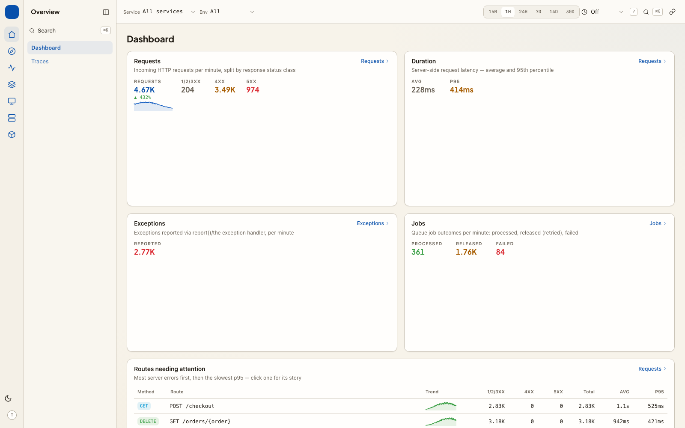
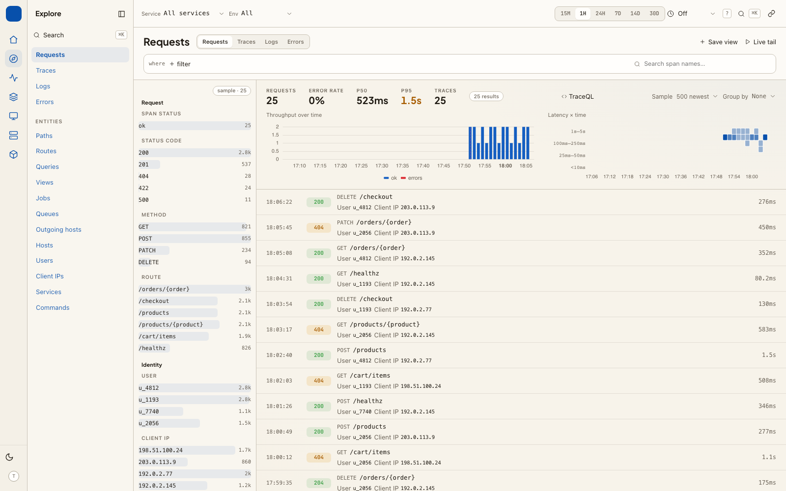
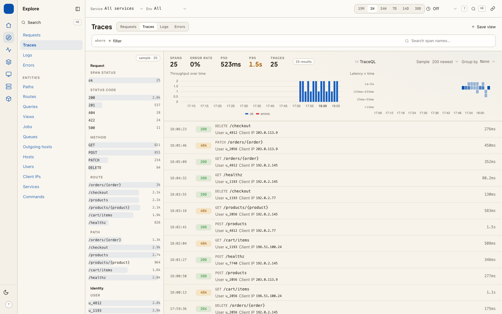
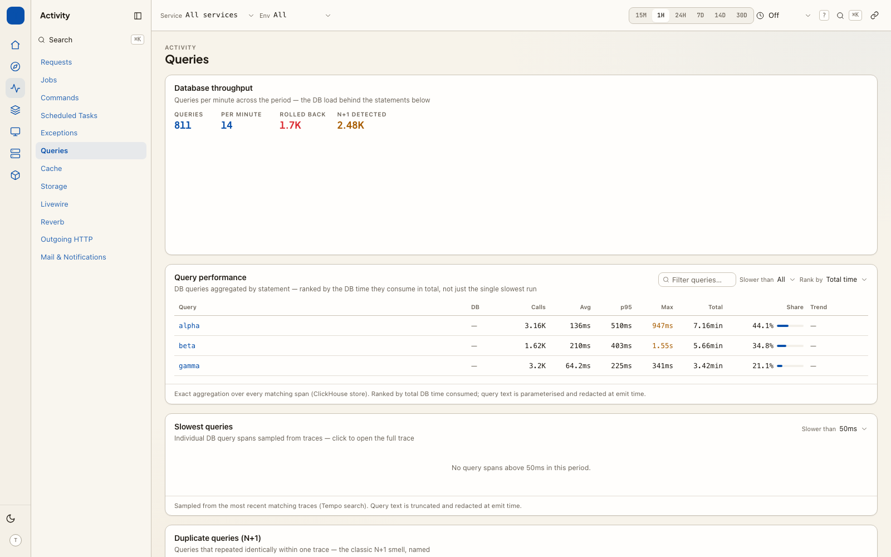
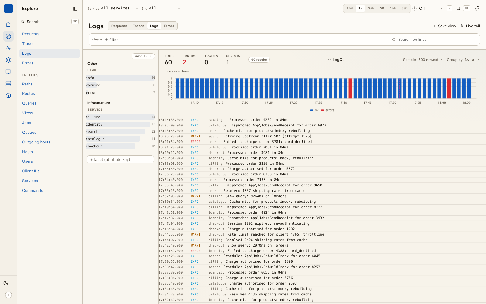
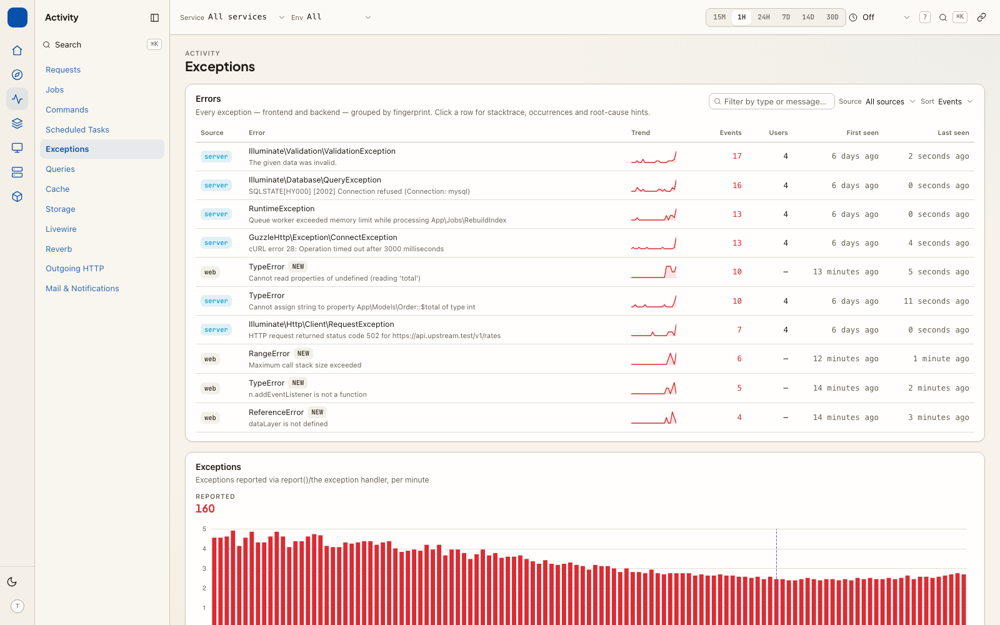
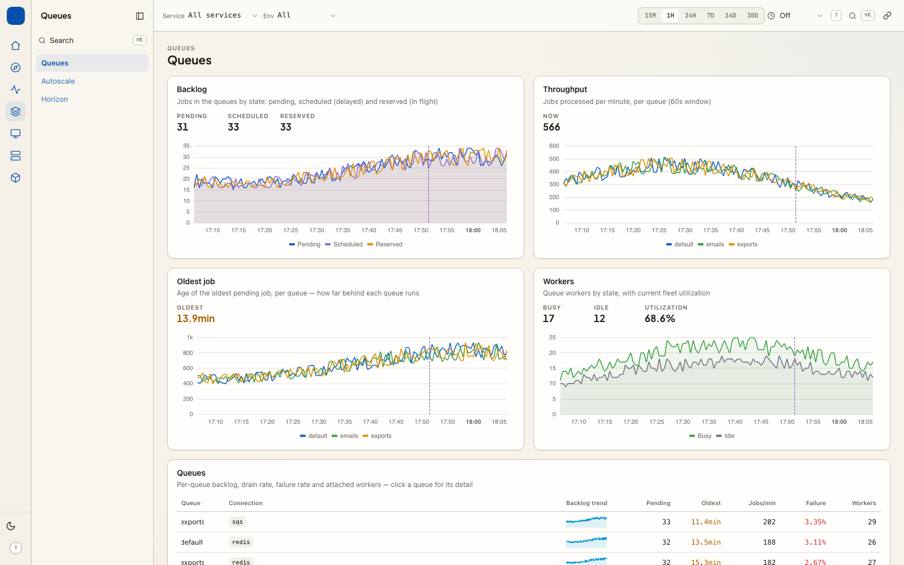
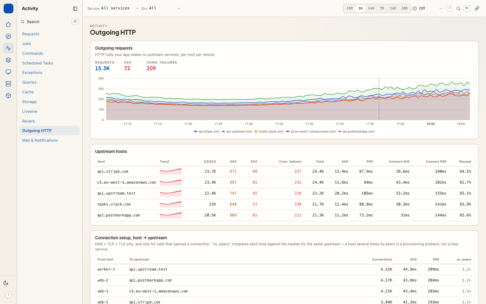

# Laravel Telemetry UI

`cboxdk/laravel-telemetry-ui` is a Laravel-native observability dashboard that
queries your existing Grafana stack — **Tempo** (traces), **Loki** (logs) and
**Prometheus/Mimir** (metrics) — directly. No agent, no vendor cloud, no data
leaves your infrastructure.

It is the presentation counterpart to
[`cboxdk/laravel-telemetry`](https://github.com/cboxdk/laravel-telemetry): the
emitting package defines a stable schema of metric names, span attributes and
resource attributes, and this package is *schema-aware*. That is what lets it
render opinionated, Laravel-shaped screens (Requests, Jobs, Queries,
Exceptions, Users…) instead of Grafana's generic panels — and link them:
click a slow route, see its traces; open a trace, see the queries and the
trace-correlated logs.



v2 is a versioned JSON API plus a prebuilt React app the package serves itself,
so hosts need no Node toolchain. Everything on a page is a **panel**, a plain
PHP class your packages can add to:

```php
TelemetryUi::page('autoscale', 'Autoscale', group: 'Queues');
TelemetryUi::panel(AutoscaleDecisions::class, page: 'autoscale');

final class AutoscaleDecisions extends Panel
{
    public function data(): array
    {
        return $this->promChart(
            'Scaling decisions',
            $this->metric('autoscale_scaling_events_total')->rate('5m')->sumBy('queue'),
            seriesLabel: 'queue',
        );
    }
}
```

And any attribute your app emits can become a first-class **dimension** — a
facet, a group-by option, a filter chip and an entity page:

```php
TelemetryUi::dimension('billing.customer_id', label: 'Customer',
    link: fn ($id) => route('customers.show', $id));
```

Dimensions bend to what your app already emits. Show names instead of ids
(`TelemetryUi::resolve('user.id', User::class, 'name')`), read a dimension out
of another attribute when a routing layer encodes it there
(`from: 'http.route', pattern: 'portal:{value}'`), give that layer its own page
with `routeFamily()`, or declare a chart over any metric — including one from a
sidecar in another language — with `metricPanel()`, no panel class needed. See
[dimensions & Explore](core-concepts/dimensions-and-explore.md) and
[developer integrations](extension-points/index.md).

## Why not just Grafana?

Grafana is generic; this dashboard knows what a Laravel app *is*. Routes,
jobs, scheduled tasks, cache stores and users are first-class concepts, cross
linked across signals. It also lives inside your app: your auth, your gate,
and actions a read-only dashboard can never do — create a
ticket from an exception, or hand the whole stack to an agent over MCP for
incident RCA.

## Documentation

- [Getting started](getting-started/installation.md)
- Core concepts:
  [connections](core-concepts/connections.md) ·
  [pages & panels](core-concepts/pages-and-panels.md) ·
  [dimensions & Explore](core-concepts/dimensions-and-explore.md) ·
  [JSON API](core-concepts/api.md) ·
  [configuration reference](core-concepts/configuration.md) ·
  [authorization](core-concepts/authorization.md) ·
  [signal correlation](core-concepts/correlation.md) ·
  [infrastructure discovery](core-concepts/infrastructure.md)
- Cookbook:
  [web analytics & RUM](cookbook/analytics.md) ·
  [connect through a Grafana datasource proxy](cookbook/connect-via-grafana-proxy.md) ·
  [emitting annotations](cookbook/annotations.md) ·
  [MCP server](cookbook/mcp.md) ·
  [embedding the dashboard in your own app](cookbook/embed-widgets.md)
- Extension points — **[Developer integrations guide](extension-points/index.md)** (start here) ·
  [custom panels](extension-points/custom-panels.md) ·
  [custom detail pages](extension-points/detail-pages.md) ·
  [custom drivers](extension-points/custom-drivers.md) ·
  [issue trackers](extension-points/issue-trackers.md)
- [Upgrading from 1.x](../UPGRADE.md)
- [Design direction](design/direction.md)
- [Architecture decision records](adr/)
- [Roadmap](roadmap.md)

## The screens















The infrastructure pages are shown in
[infrastructure discovery](core-concepts/infrastructure.md), and the analytics
page in the [web analytics cookbook](cookbook/analytics.md).

Every screenshot here is captured from the package's own browser tests
against the fixture backends, so what is pictured is what the code renders —
not a mock-up, and not a staging environment that has since changed. See
`src/Testing/ScreenshotManifest.php`.
